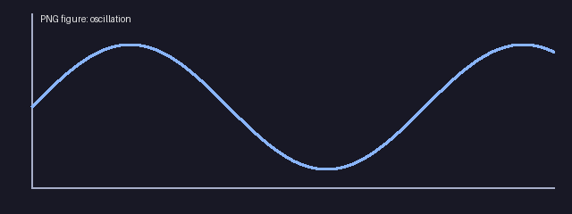

# Markdown Preview

Read Markdown with **native terminal text**, equations and PNG figures.

Inline math: $E=mc^2$, a fraction $\frac{a+b}{c}$, and a root $\sqrt{x^2+y^2}$.

## Display equations

$$
\int_0^\infty e^{-x^2}\,dx = \frac{\sqrt{\pi}}{2}
$$

$$
A = \begin{pmatrix}1 & 2 \\ 3 & 4\end{pmatrix}
$$

## PNG figure



## Links

[Open another Markdown document](second.md)

## Code and literal dollars

```python
price = "$5"
print("$x$ stays code")
```

- Equations are rendered locally.
- Editing this file or its PNG refreshes the preview.
- Press / to search, o to open, r to refresh, or q to quit.

| Feature | Supported |
| --- | --- |
| Common LaTeX | Yes |
| PNG figures | Yes |
